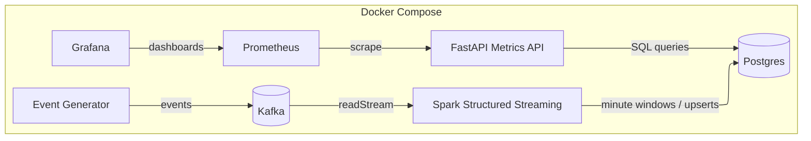

# 🚀 Real-Time Streaming Analytics  
*(Kafka → Spark Structured Streaming → Postgres → FastAPI → Prometheus → Grafana)*

A Docker Compose–based, end-to-end **real-time analytics pipeline** that ingests events, performs minute-window aggregations, stores durable metrics, and exposes them via APIs and dashboards.

This repository is designed to be:

- **One-command runnable**
- **Deterministic and restart-safe**
- **CI-friendly**
- **Fully observable**

---

## 🧱 Architecture Overview


---

## ▶️ Quickstart

```bash
make up
make smoke
```

---

## ♻️ Resetting State

```bash
make reset
```

---

## 🌐 API Examples

```bash
curl http://localhost:8000/health
curl "http://localhost:8000/metrics?minutes=10&limit=5" | jq
curl "http://localhost:8000/metrics/latest" | jq
curl "http://localhost:8000/streams/top?minutes=10&by=donations_usd&n=5" | jq
curl http://localhost:8000/prometheus
```

---

## 📊 Observability

Grafana dashboard: **Real-time Streaming Analytics — Overview**

Panels include:
- API RPS
- API p95 latency
- DB OK gauge
- Stream rows (last 5 minutes)
- Donation rows (last 5 minutes)
- Latest window age (seconds)

---

## 📚 Documentation

All detailed documentation lives in the `docs/` directory.

- **[Documentation Index README](docs/README.md)**
- How to run the system: [`quickstart.md`](docs/quickstart.md)
- Architecture and data flow: [`architecture.md`](docs/architecture.md)
- Design decisions: [`decisions.md`](docs/decisions.md)
- Make targets and workflows: [`makefile.md`](docs/makefile.md)
- Smoke test validation: [`smoke-tests.md`](docs/smoke-tests.md)
- Observability details: [`observability.md`](docs/observability.md)
- Grafana dashboard guide: [`grafana-dashboard.md`](docs/grafana-dashboard.md)
- Operations and lifecycle: [`operations.md`](docs/operations.md)
- Troubleshooting steps: [`troubleshooting.md`](docs/troubleshooting.md)
- Recovery procedures: [`runbooks.md`](docs/runbooks.md)
- Terminology reference: [`glossary.md`](docs/glossary.md)
- Script reference: [`scripts/README.md`](scripts/README.md)

---

## 🔍 Troubleshooting

```bash
make doctor
```

## Documentation

