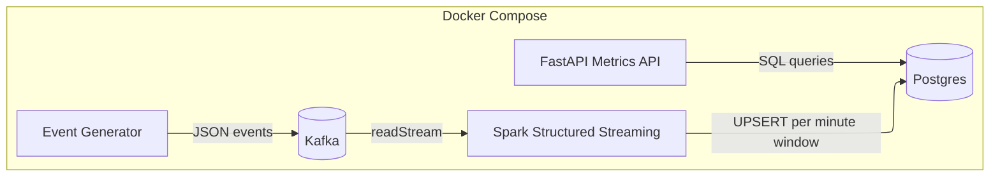

# Real-Time Streaming Analytics (Kafka → Spark → Postgres → FastAPI)

A Docker Compose-based real-time analytics pipeline:
- **Kafka** for event ingestion
- **Spark Structured Streaming** for minute-window aggregations
- **Postgres** for durable metrics storage (upsert-safe)
- **FastAPI** for query APIs (`/metrics`, `/streams/top`, etc.)
- **Smoke tests** to validate the full pipeline end-to-end

---

## Architecture


---

## Quickstart

### Prereqs
- Docker + Docker Compose
- GNU Make

### Run the stack
```bash
make up
```

### Run smoke tests (recommended)
Smoke validates:
- topic exists
- offsets advance
- Spark healthy
- Postgres has recent rows
- **donations aggregation works** (deterministic donation injection)
- API `/health` and `/metrics` respond

```bash
make smoke
```

### Full reset (wipe volumes)
Use this when you want Postgres init scripts to re-run (fresh DB):
```bash
make reset
```

---

## Services

- **Kafka + Zookeeper**: event ingestion
- **Event Generator**: produces `stream.events`
- **Spark (stream-processor)**: minute-window metrics aggregation + Postgres upserts
- **Postgres**: stores `stream_metrics_minute`, `stream_state`
- **FastAPI (metrics-api)**: query metrics via HTTP

---

## Event format (Kafka topic: `stream.events`)

Example donation event:
```json
{
  "event_id": "manual-donation-1",
  "ts": "2025-12-20T18:34:38.300308+00:00",
  "event_type": "donation",
  "stream_id": "stream_1001",
  "user_id": "user_999",
  "amount_usd": 25.0
}
```

Supported event types (typical):
- `viewer_join`, `viewer_leave` → contributes to `active_viewers` state
- `chat_message` → contributes to `chat_messages`
- `donation` (`amount_usd`) → contributes to `donations_usd`

---

## Data model (Postgres)

### `stream_metrics_minute`
Primary key: **(window_start, stream_id)**

Columns:
- `window_start`, `window_end`
- `stream_id`
- `active_viewers`
- `chat_messages`
- `donations_usd`

### `stream_state`
Primary key: **(stream_id)**  
Stores current active viewers for each stream.

> Tables are initialized via Postgres init scripts in `sql/init/`.

---

## API

Base URL:
- http://localhost:8000

### Health
```bash
curl -s http://localhost:8000/health
```

### Metrics (filter + lookback)
```bash
curl -s "http://localhost:8000/metrics?minutes=10&limit=5" | jq
```

Filter by stream:
```bash
curl -s "http://localhost:8000/metrics?stream_id=stream_1001&minutes=30&limit=20" | jq
```

### Latest complete window
```bash
curl -s "http://localhost:8000/metrics/latest?stream_id=stream_1001" | jq
```

### Top streams (by donations/chat/viewers)
```bash
curl -s "http://localhost:8000/streams/top?minutes=10&by=donations_usd&n=5" | jq
```

---

## Streaming semantics (guarantees)

- **Windowing**: metrics are computed per **1-minute window** per `stream_id`
- **Late data handling**: watermark applied (configurable)
- **Upsert-safe writes**: Postgres upsert ensures a single row per `(window_start, stream_id)`
- **Restart safety**: checkpointing ensures Spark can resume without duplicating state

---

## Troubleshooting

### Postgres init scripts not running
Postgres runs `/docker-entrypoint-initdb.d` scripts only on a **fresh** data directory.

Fix:
```bash
make reset
```

### Kafka offsets not advancing
Check producer logs:
```bash
docker compose logs -f event-generator
```

### Spark startup / Ivy cache issues
Ensure Spark has writable `/tmp` and checkpoints volume. Check logs:
```bash
docker compose logs -f spark-stream
```

---

## CI

GitHub Actions runs `make up` + `make smoke` on every push/PR.

---

## Optional Observability (Planned)

This repo is designed to add observability later with minimal changes:
- **Prometheus**: scrape API + (optional) Spark metrics endpoint
- **Grafana**: dashboards for donations/chat/viewers per stream

When implemented, this section will be expanded with:
- `docker-compose` additions (`prometheus`, `grafana`)
- scrape config + dashboard import steps
- extra Make targets (e.g., `make obs-up`)

---

## Roadmap

- [ ] Prometheus + Grafana observability pack
- [ ] README screenshots + sample dashboard
- [ ] More API queries (pagination, advanced filters)
