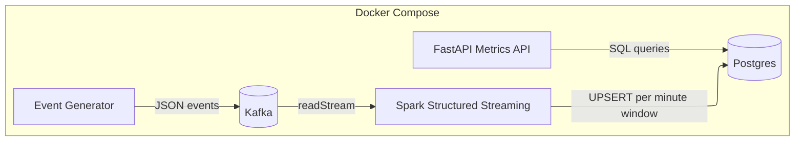

# 🚀 Real-Time Streaming Analytics <br>(Kafka → Spark → Postgres → FastAPI)

A Docker Compose-based real-time analytics pipeline:
- **Kafka** for event ingestion
- **Spark Structured Streaming** for minute-window aggregations
- **Postgres** for durable metrics storage (upsert-safe)
- **FastAPI** for query APIs (`/metrics`, `/streams/top`, etc.)
- **Smoke tests** to validate the full pipeline end-to-end

This repo is designed to be:
- **one-command runnable**
- **CI-friendly**
- **restart-safe**

---

## 🧱 Architecture



---
## 📚 Documentation

- 📘 **[Runbook](docs/runbook.md)** — how to run, debug, and recover the system  
- 🧠 **[Architecture Decisions](docs/decisions.md)** — why these tools and patterns were chosen  
- 🛠️ **[Scripts Reference](scripts/README.md)** — helper scripts explained  
- 🗂️ **[Project Index](Index.md)** — navigation + notes

---

## Repo Map

### Top-level
- `docker-compose.yml` — full stack definition
- `Makefile` — shortcuts (`make up`, `make reset`, `make smoke`, `make commit`)
- `README.md` — project overview
- `Index.md` — project notes / index
- `docs/`
  - `runbook.md` — operational guide
  - `decisions.md` — architectural decisions
- `architecture/`
  - `architecture.mmd` — diagram source
  - `docker.png` — exported architecture diagram

### Services
- `services/event-generator/` — Kafka producer
- `services/stream-processor/` — Spark Structured Streaming job
- `services/metrics-api/` — FastAPI metrics service

### Database
- `sql/init/001_stream_tables.sql` — Postgres init schema
- `sql/postgres_init.sql` — legacy init (optional)

### Scripts
- `scripts/start.sh` — start stack
- `scripts/stop.sh` — stop stack
- `scripts/reset.sh` — full reset (wipe volumes)
- `scripts/smoke.sh` — end-to-end smoke test
- `scripts/doctor.sh` — diagnostics
- `scripts/git_commit.sh` — commit helper
- `scripts/lib.sh` — shared bash helpers
---
## ▶️ Quickstart

```bash
make up
make smoke
```

♻️ Full reset (wipe volumes, re-run DB init):
```bash
make reset
```

---

## 🧪 Smoke Tests

Smoke tests validate:
- 📡 Kafka topic exists
- ⚡ Producer offsets advance
- 🔥 Spark is healthy
- 🐘 Postgres has recent rows
- 💰 Donations aggregate correctly
- 🌐 API endpoints respond

```bash
make smoke
```

---

## 🌐 API Examples

```bash
curl -s http://localhost:8000/health
curl -s "http://localhost:8000/metrics?minutes=10&limit=5" | jq
curl -s "http://localhost:8000/streams/top?minutes=10&by=donations_usd&n=5" | jq
```

---

## Database Notes

Postgres init scripts run only on a fresh data directory.

If tables did not change:
```bash
make reset
```

---

## Troubleshooting

Run diagnostics:
```bash
bash scripts/doctor.sh
```

Check logs:
```bash
docker compose logs -f spark-stream
```

---

## Git Workflow

Auto commit:
```bash
make commit
```

Custom message:
```bash
make commit MSG="api: improve top streams endpoint"
```

---

## 📊 Observability (Planned)

- 📈 Prometheus metrics
- 📊 Grafana dashboards

---

## Roadmap

- [ ] Observability
- [ ] Dashboard screenshots
- [ ] Advanced API filters
