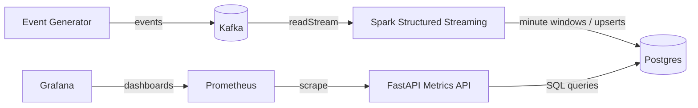

# Architecture

This document describes the architecture and data flow of the **Real-Time Streaming Analytics** system.

The system is designed to be:
- Deterministic
- Restart-safe
- Observable
- Easy to operate locally and in CI

---

## High-Level Data Flow

All components run locally using Docker Compose.

---

## Component Responsibilities

### Event Generator
- Produces JSON events continuously
- Acts as a steady, deterministic event source
- Used to validate streaming behavior end to end

---

### Kafka
- Serves as the ingestion buffer
- Decouples event production from stream processing
- Ensures Spark can restart without data loss during local runs

---

### Spark Structured Streaming
- Reads events from Kafka
- Aggregates data into **minute-based windows**
- Performs deterministic aggregations (including donations)
- Writes results to Postgres using **idempotent upserts**
- Maintains checkpoints to ensure restart safety

Spark is the only component that performs transformations.

---

### Postgres
- Acts as the system of record for aggregated metrics
- Stores per-minute stream metrics and donation aggregates
- Supports idempotent writes from Spark
- Serves as the query backend for the API

Postgres initialization scripts run only on a fresh data directory.

---

### FastAPI Metrics API
- Provides query endpoints over aggregated data
- Exposes both JSON APIs and Prometheus-compatible metrics
- Acts as the boundary between storage and observability

The API does not perform aggregation; it only queries stored results.

---

### Prometheus
- Scrapes metrics from the FastAPI `/prometheus` endpoint
- Stores time-series metrics for observability
- Used both locally and in CI observability validation

---

### Grafana
- Visualizes Prometheus metrics
- Is pre-provisioned with:
  - Prometheus datasource
  - A ready-to-use dashboard

The dashboard provides a real-time view of system health and stream activity.

---

## Design Notes

- **Idempotency**: Spark upserts ensure safe restarts
- **Determinism**: Smoke tests rely on predictable behavior
- **Separation of concerns**: Each component has a single responsibility
- **Observability-first**: Metrics and dashboards are part of the core system

---

## Additional Documentation

- Back to repository root: [`README.md`](../README.md)
- How to run the system: [`quickstart.md`](quickstart.md)
- Architecture and data flow: [`architecture.md`](architecture.md)
- Design decisions: [`decisions.md`](decisions.md)
- Make targets and workflows: [`makefile.md`](makefile.md)
- Smoke test validation: [`smoke-tests.md`](smoke-tests.md)
- Observability details: [`observability.md`](observability.md)
- Grafana dashboard guide: [`grafana-dashboard.md`](grafana-dashboard.md)
- Operations and lifecycle: [`operations.md`](operations.md)
- Troubleshooting steps: [`troubleshooting.md`](troubleshooting.md)
- Recovery procedures: [`runbooks.md`](runbooks.md)
- Terminology reference: [`glossary.md`](glossary.md)

